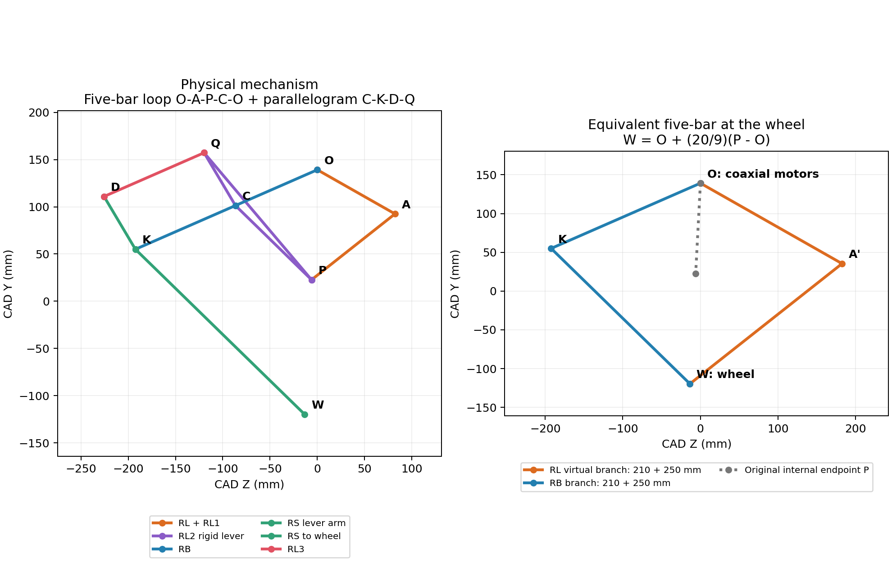

# 串联轮腿闭链与等效五连杆

## 工程接入与新版导出（2026-10-03）

`exports/export_20261003_181515/` 是本次独立导出目录，原始 ZIP、USDZ 和 source 文件没有覆盖：

- `mine_closed_chain.usd`：完整物理模型，包含四个闭链 revolute 约束、网格、质量和惯量；Isaac Lab 使用这个文件。
- `mine_robot.urdf` + `meshes/`：标准坐标下的关节树。URDF 本身无法表达四个额外闭环，单独导入这份 URDF 会丢失闭链。
- `model.json`：坐标转换、主动关节、几何、质量、轮距、哈希和闭合轴心。
- `closures_cad.json`：原 CAD 坐标下的四个闭合铰链定义。

工程副本位于 `wheel_legged_isaaclab/assets/robots/mine/export_20261003_181515/`，
`assets/robots/mine/manifest.json` 指向当前版本。
`WheelLeggedVMC-Flat-v0` 现默认加载你的 USD；原开源 URDF 保留，使用
`WheelLeggedVMC-Legacy-v0` 可运行原模型（例如 `./play_wheel.sh --task WheelLeggedVMC-Legacy-v0 ...`）。
新模型使用独立实验名 `mine_wheel_legged_vmc_flat`。原策略的维度虽然也是 27/6，
其串联腿关节定义和动力学不同，不能据此认为能直接替换策略。本次没有训练或迁移原策略。

新 base_link：**X 前、Y 左、Z 上**；与原 CAD 的关系是 `new XYZ = old ZXY`。
转换了根节点下的关节原点以及 base 的视觉、碰撞、惯性坐标，保留子链局部坐标和实际装配姿态。
四个髋电机均以 base_link 为父刚体；角度零点是 CAD 装配姿态，几何偏置单独进入五连杆计算。
左右轮定义为连续旋转，原文件内的轮关节限位没有被修改。

控制适配位于 `wheel_legged_isaaclab/wheel_legged_gym_isaaclab/five_bar_vmc.py` 与
`tasks/direct/wheel_legged_vmc_flat/mine_env_cfg.py`：

```text
主动电机顺序：LB, LL, LW, RB, RL, RW
策略动作顺序：左腿摆角, 左腿长度, 左轮速, 右腿摆角, 右腿长度, 右轮速
q = [q_B, q_L]，两个角均相对 base_link
J(q) = d[腿长 L, 摆角 theta] / d[q_B, q_L]
[L_dot, theta_dot] = J(q) q_dot
[tau_B, tau_L] = J(q)^T [F, T]
theta = atan2(-X_wheel, -Z_wheel)   # 相对髋轴，向后为正，与原工程观测约定一致
```

这里的 theta 与下文 CAD 工具 `FiveBar.virtual_state()` 的朝前正角度符号相反，
工程雅可比和力矩映射已同步处理，右腿轴向符号包含在 J 内。
PhysX 使用你的 15 个刚体各自的质量/惯量和四个外部闭链约束计算动力学；
没有把杆件质量粗略合并到等效五连杆，也没有继续使用原串联腿的力矩矩阵。
驱动报告附有固定基座 14×14／自由基座 20×20 的广义树质量矩阵，
它们不是约束消元后的 6×6 主动关节质量矩阵。

总质量 10.4969 kg，轮半径标称 60 mm，轮胎中心距 419.9 mm，默认根高度 294.19 mm。
高度换算使用 `L_down = root_height + hip_z - wheel_radius`，其中 `hip_z = 24.654 mm`。
腿/轮力矩上限均沿用导出值 10 N·m；轮速阻尼由原工程 0.5 调整到 0.02，
避免小轮惯量在 5 ms 显式控制步长下振荡。当前腿长目标范围 0.18–0.36 m、
高度指令 0.28–0.32 m 是接入初始范围，并非全部范围都已经通过驱动验证。

### 可复现驱动测试

```bash
cd ~/studyRL/src/CLT-RL
./test_mine_drive.sh --num_envs 1 --loop                 # GUI 循环驱动演示
./test_mine_drive.sh --headless --num_envs 2 --seconds 12
./test_mine_drive.sh --headless --floating --seconds 1 --output mine_model/results/gravity_recheck
PYTHONPATH=wheel_legged_isaaclab ./run_python.sh -m unittest discover -s wheel_legged_isaaclab/tests -p 'test_*vmc.py' -v
```

已完成的双环境驱动测试见 `../results/bench_drive/report.json`、`trace.csv`、`tracking.png`。
这是固定基座、悬空、关闭重力的 12 秒 VMC 测试；两环境使用不同相位，验证了闭链克隆关系。
腿长围绕 259.19 mm 变化 ±12 mm，摆角围绕 2.99° 变化 ±3.44°，轮速变化 ±3 rad/s。

| 检查 | 测量结果 |
| --- | --- |
| 腿长跟随平均绝对误差（2 s 后） | 0.838 mm |
| 摆角跟随平均绝对误差（2 s 后） | 0.098° |
| 轮速跟随平均绝对误差（2 s 后） | 0.0374 rad/s |
| 闭链轴心最大间隙 | 0.00080 mm |
| 五连杆预测轮轴位置相对 PhysX 最大误差 | 0.00222 mm |
| 重置 / 数值异常 | 0 / 0 |

五项数学测试通过：五连杆虚功/速度、零位/镜像、奇异位形拒绝，以及原串联 VMC 的两项回归测试。

**自由基座站立尚未通过。** `../results/gravity_check/report.json` 中的 `passed`
只表示机械完整性检查通过：1 秒重力测试最大闭链间隙 0.210 mm、非重置帧 FK 误差 0.823 mm，
没有数值异常；但两个环境累计 4 次机身接地重置，根高度最低 0.140 m。
该测试没有使用平衡控制器或 RL 策略，不能作为站立/行驶控制通过的结论。
下一步需将已调好的平衡控制器接到此模型，再做落地站立和速度跟随验证。


已按实际机构补齐左右四个 revolute 铰链，并在导入副本、USD 和检查界面中将
`link_002_joint` 改为 `RB_joint`。原始 ZIP 和 `source/` 导出数据保留，规范化的
URDF 与元数据位于 `prepared/`。

## 可视化和调角度

```bash
cd ~/studyRL/src/CLT-RL/mine_model
./run.sh inspect
```

默认打开闭链场景：固定基座、零重力、PhysX 求解，18 个 revolute 关节中有 6 个主动关节。
选择 `RB_joint / RL_joint` 调右腿，选择 `LB_joint / LL_joint` 调左腿；
`RW_joint / LW_joint` 是轮关节。

- `Actuator target (degrees)`：滑块或数字框设置主动关节目标角，单位度。
- `Actual`：实际角度；`pivot gap`：当前铰链两侧轴心间隙，单位毫米。
- 被动关节角度只读，随闭链求解运动。
- `Zero joint / Zero all`：将当前／全部主动目标设为零，由驱动回位。
- `Equivalent five-bar`：显示等效五连杆；右侧紫色、左侧绿色。
- 等效线条沿铰轴向外偏移 25 mm 以免遮挡，Y/Z 平面内位置保持原比例。
- `Hide base visuals` 隐藏机身；`Only selected axis` 仅显示当前轴线。
- `Focus joint` 聚焦；`Right side / Left side` 切换侧视；相机以 CAD +Y 为上方。

检查界面的目标角、显示和姿态修改仅存在于 session layer，不写回物理资产。
目前主动关节限位约 ±89.95°，验证范围是各主动关节单独 ±10°，未验证全部组合和限位附近。

需要逐个自由转动被动杆时，可以显式打开不受闭链约束的运动学检查模式：

```bash
./run.sh inspect --open-chain
```

## 父节点和角度基准

| 关节 | 父刚体／角度参考 | 子刚体 |
| --- | --- | --- |
| RB_joint | base_link | RB_link |
| RL_joint | base_link | RL_link |
| LB_joint | base_link | LB_link |
| LL_joint | base_link | LL_link |

原始导出中这四项已经连接 `base_link`，导入脚本和检查界面会校验实际 USD `body0`，
并在 USD 中明确记录 `angleReference=base_link`。RL/LL 不使用 RB/LB 作为角度参考。

面板和控制输入 `q` 的 **0° 是导出的装配姿态**，是关节相对于 base_link 的转角增量。
当需要杆件在 base_link 坐标内的绝对方向时，使用 `FiveBar.base_angles(q)`，
返回 YZ 平面内从 +Y 朝 +Z 的角度。它包含 CAD 装配偏置：`theta = offset + sign*q`。
`motor_angles_from_base(theta)` 执行逆变换。转动 RB 不改变 RL 的独立 base_link 角度定义。

## 闭合轴心

`config/closures.json` 中坐标使用原 CAD 世界坐标、毫米。孔轴沿 CAD X。
`scripts/find_closure_axes.py` 从 STL 端面孔轮廓拟合圆心，并匹配两刚体的同轴孔。
Y/Z 最大同轴偏差约 0.000004 mm；沿轴的 X 坐标取相邻板面中点，不改变铰轴直线。

| 闭合关节 | 连接 | CAD 轴心 XYZ，mm |
| --- | --- | --- |
| RL3_RS_closure | RL3 末端孔 → RS 末端孔 | -321.449799, 110.908800, -225.557425 |
| RL2_RB_closure | RL2 中间孔 → RB 中间孔 | -307.449799, 101.303404, -86.576178 |
| LL3_LS_closure | LL3 末端孔 → LS 末端孔 | 61.950211, 110.908800, -225.557425 |
| LL2_LB_closure | LL2 中间孔 → LB 中间孔 | 47.950211, 101.303404, -86.576178 |

闭合关节设置 `excludeFromArticulation=true`，由 PhysX 在原关节树之外求解，且不配置 Drive。

## 五连杆映射

右侧定义：O 为同轴髋电机轴；A 为 RL/RL1 轴；P 为 RL1/RL2 轴；
C 为 RL2/RB 闭合轴；K 为 RB/RS 膝轴；Q 为 RL2/RL3 轴；
D 为 RL3/RS 闭合轴；W 为轮轴。

- 内部五连杆主环：O–A–P–C–O，两主动臂 OA=OC=94.5 mm，两从动臂 AP=CP=112.5 mm。
- 平行四边形传动环：C–K–D–Q–C，CK=QD=115.5 mm，KD=CQ=65 mm。
- 默认装配分支中，轮心映射为 `W = O + (20/9) * (P - O)`。
- 放大到轮心后的等效五连杆：两主动臂 210 mm，两从动臂 250 mm，两机架铰轴同轴。



`scripts/five_bar.py` 实现默认装配分支的正运动学、轮心 Jacobian、虚拟腿长/角度及虚功力矩映射。
输入顺序是右侧 `(RB, RL)`、左侧 `(LB, LL)`，单位弧度；CAD Y/Z 平面坐标单位米。
右侧电机正转对应 CAD -X 转动，左侧对应 +X，已分别处理。
虚拟腿角从 CAD -Y 朝 +Z 计；这与上述杆方向 theta 的零轴不同。
奇异位形会报错；运动学等效不意味着连杆质量、惯量可以直接合并或忽略。

```python
from five_bar import FiveBar
leg = FiveBar("right")
wheel_yz = leg.forward([0.0, 0.0])  # 相对髋轴的轮心位置，m
length, angle = leg.virtual_state([0.0, 0.0])
theta_b, theta_l = leg.base_angles([0.0, 0.0])
jacobian = leg.jacobian([0.0, 0.0])
tau_b, tau_l = leg.motor_torques([0.0, 0.0], radial_force=10.0, angular_torque=0.0)
```

## 复现构建和验证

```bash
python3 scripts/find_closure_axes.py
./run.sh build --headless --steps 5760 --sweep
python3 -m unittest test_five_bar.py
```

2026-10-03 验证：6 个主动关节依次作 ±10° 平滑运动，各 4 s，总计 5760 步、24 s 仿真。
通过 PhysX 实时刚体状态检查，最大闭合轴心误差 **0.0572 mm**，最大铰轴偏差 **0.000041°**。
五连杆预测轮心与物理轮心的最大差异：右侧 **0.2144 mm**、左侧 **0.0731 mm**。
4 项测试覆盖 CAD 默认轮心和杆长、数值差分 Jacobian、左右轴向镜像、base_link 角度基准，全部通过。
结果见 `build/closed_chain_sweep_report.json`。

`build/closed_chain.usda` 依赖同目录 `configuration/`，移动时一起复制。
`prepared/` 还修复了原 STL 文件名中连字符导致的 USD `Used null prim` 导入错误。

当前验证关闭自碰撞并固定基座、使用零重力，属于机构验证，尚非落地平衡或 RL 策略验证。
主动 Drive 的 stiffness=100、damping=2、maxForce 使用 URDF effort，仅用于机构检查。
原始导出仍需后续核对：158 个 CAD 零件未分配、左右轮质量分别 0.278905642/0.665 kg、
轮关节带 ±1.57 rad 限位。这些数据保留原值。
