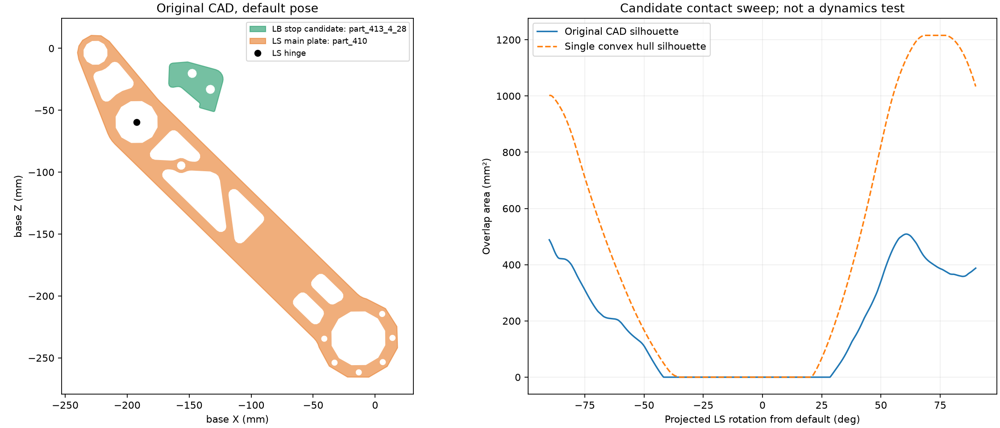
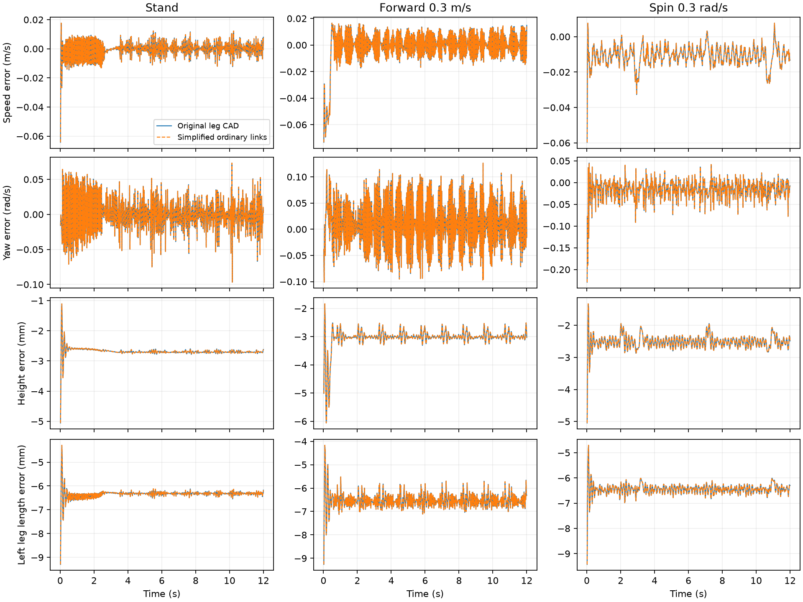
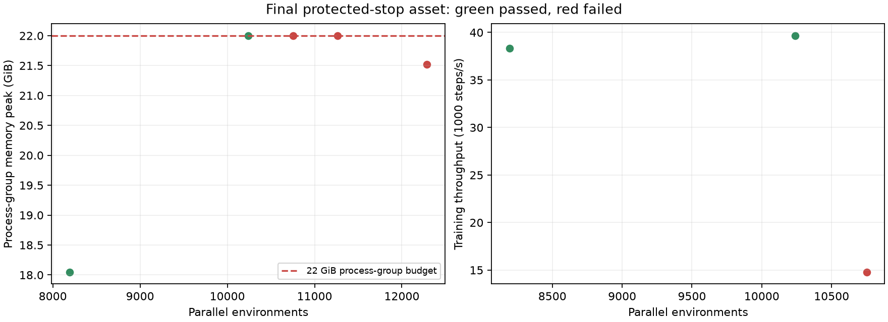

# 碰撞简化、机械限位与并行环境实测

本文补充《开链转闭链图文教程_v3》。原始 URDF、原闭链 USD 和原 CAD 显示网格保留；所有碰撞变体另存。

## 资产与碰撞结构

|版本|启用 CollisionAPI 的节点数|变化|
|---|---:|---|
|原闭链圆轮 USD|459|底盘有 431 个 CAD 碰撞节点|
|仅简化底盘|29|底盘换为一个包围盒；腿轮碰撞保留|
|普通腿连杆也简化|21|普通零件合并凸包；限位块、小腿接触主板和圆轮保留|

节点数不是运行时 PhysX shape 数：一个凸分解 Mesh 可生成多个凸体。模型原先已实例化，使用内部共享原型；新包围盒和普通连杆使用独立共享网格 USD 引用。

## 保留的机械接触表面

左限位块：LB_link/part_413_4_28；右限位块：RB_link/part_192_4_28。左小腿主板：LS_link/part_410___1_15；右小腿主板：RS_link/part_156___1_15。四个 CAD Mesh 的顶点及拓扑不变，碰撞采用凸分解；没有把限位块替换成单一凸包或盒子。

上图为 CAD 投影识别，不能直接当成完整闭链腿的行程范围。实际运动测试中，目标 0.12 m 被挡在约 0.1784–0.1789 m；目标 0.42 m 被挡在约 0.3542–0.3546 m。目标 0.18 m 可正常跟踪。固定高位机身、零重力、300/3 force Drive、10 Nm 的过行程测试中，最大闭链铰链孔位误差约 0.168 mm，限位接触峰值约 448 N。

GPU 接触回调没有返回可用的接触点分离距离，求解器接触深度仍是未知。另用GPU实测刚体位置和四元数还原原始CAD接触件，逐个检查4组过行程测试的全部50 Hz采样位姿；结果见 cad_nonpenetration.json。若所有投影均无交叠，可证明这些采样点没有CAD实体相交，但不能推断所有物理子步或连续时间穿透为零。此几何报告与全部资产来源哈希也纳入最终交付门控。

GPU位姿几何复核结果：左右两对接触件各检查2400个采样位姿，原CAD投影交叠面积最大值均为0 mm²；上述采样点没有CAD实体穿入。

## 为什么修改求解树与碰撞过滤

原 articulation 自碰撞关闭；仅启用自碰撞仍会忽略相邻刚体之间的限位接触。为使 LB–LS、RB–RS 能碰撞，将 LS_joint/RS_joint 作为外部闭链约束，将已有 LL3_LS_closure/RL3_RS_closure 纳入树。15 刚体、18 个真实铰链、质量/惯量、铰链轴与位置均保留；仅换闭链的求解树。

passive joint 表达式改为 `[LR]L[123]_joint` 和 `[LR]L3_[LR]S_closure`，自碰撞启用。主动电机和轮关节继续按名称查找，当前力矩列对应 articulation IDs 为 `[0,1,12,2,3,13]`；不能沿用旧的硬编码 IDs。五连杆 FK、几何长度及 base_link 摆角参考未因碰撞简化改变。

使用 ordinary/stops/shanks 三个碰撞分组，仅允许限位块与小腿接触主板之间的内部碰撞；地面接触保留。Isaac Lab 初始化时把分组移到场景根部，列出各环境的碰撞体，避免 PhysX 尝试复制不支持的 CollisionGroup 对象。四环境限位测试和27组策略回放结果与移组前逐项一致。

## 简化是否增加误差

固定同一 model_6500.pt、相同控制参数及种子 43/44/45，9 个平地工况各运行12秒。基线保留原腿部 CAD 碰撞；候选简化普通腿连杆；两者使用相同底盘盒、限位接触件与求解树。两者均27/27存活、零重置。

对照所有记录数据最大差异为 0.0；速度、偏航、高度、腿长、腿角、轮速及姿态误差均未增加。当前采用普通连杆简化；后续若出现误差回归，可用 base_box_stops_v2_overrides.json 恢复原腿部碰撞。此结论限于本次平地运动，不证明障碍接触或倒地碰撞外形等价。

## 最多可以开多少环境

本次测试范围内最大通过数：**10240**。用户选择的正式优化训练规模：**10240**。进程组内存限额22 GiB、swap限额1 GiB；系统约30 GiB RAM、GPU约16 GiB，同时保留桌面与IDE。

用户明确要求停止进一步容量测试并用10240开始优化训练，因此仅记录已完成的5次PPO更新验证，不声称已完成20次或长期稳定性测试。正式训练从model_6500.pt独立续训，继续每200轮回放优化；容量测试权重未作为正式训练起点。

通过条件：同源权重完成至少5次实际PPO更新、数值有限、无PhysX错误、保存checkpoint且正常退出。创建成功或保存模型后退出OOM均不算通过。

|环境数|更新数|内存峰值 GiB|整卡显存峰值 GiB|吞吐 steps/s|结果|
|---:|---:|---:|---:|---:|---:|---|
|8192|5|18.05|9.23|38330|通过|
|10240|5|22.00|10.28|39660|通过|
|10752|1|22.00|10.48|14786|失败|
|11264|0|22.00|9.17|0|失败|
|12288|0|21.52|5.49|0|失败|

10752档完成第一轮后数分钟没有完成第二轮，系统可用内存降至约1 GiB并大量交换，因此主动终止，标为资源压力下未通过；并未声称该档触发OOM或绝对无法创建。11264及12288档则在PPO更新前被cgroup OOM终止。

上述上限受当前桌面负载和22 GiB内存预算影响，不是硬件的数学绝对上限。启用机械限位凸分解及自碰撞后，开销高于只换底盘盒且不启用限位接触的测试，不能混用旧容量结果。

原始数据见 collision_comparison.json、environment_capacity_report.json 及各档 training.log/run.json。正式训练使用独立分支，不恢复容量测试产生的checkpoint。完整20%验收仍须同一权重通过12秒、独立种子12秒和30秒三阶段；本次短回放通过不代表整个训练目标完成。
